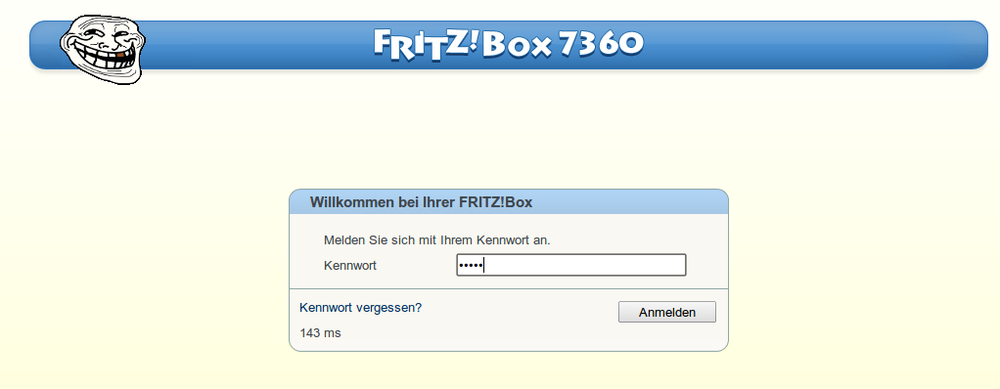

TrollBox
===============

Placing the provided debug.cfg in /var/flash/debug.cfg on your FritzBox will replace the boring default logo with a much more sophisticated Trollface

**HowTo**
 * Enable Telnet on your box (dial #96*7* on a connected phone)
 * Login using telnet (the password is the same like on the webinterface)
 * wget -O /var/tmp/debug.cfg https://raw.github.com/pc-coholic/TrollBox/master/debug.cfg
 * cp /var/tmp/debug.cfg /var/flash/debug.cfg
 * /sbin/reboot
 * Disable Telnet on your box (dial #96*8* on a connected phone)
 
**Known working devices**
 * FritzBox 7360 MNet-Edition
 * If you tried this and it worked, please leave us a message!

**Acknowledgements**

Thanks to @zwitscherleiche for lending his FritzBox and standing by, while we had to reflash it about 10 times

**Warranty/Liability**

THIS CODE AND INFORMATION ARE PROVIDED "AS IS" WITHOUT WARRANTY OF ANY KIND, EITHER EXPRESSED OR IMPLIED, INCLUDING BUT NOT LIMITED TO THE IMPLIED WARRANTIES OF MERCHANTABILITY AND/OR FITNESS FOR A PARTICULAR PURPOSE.
